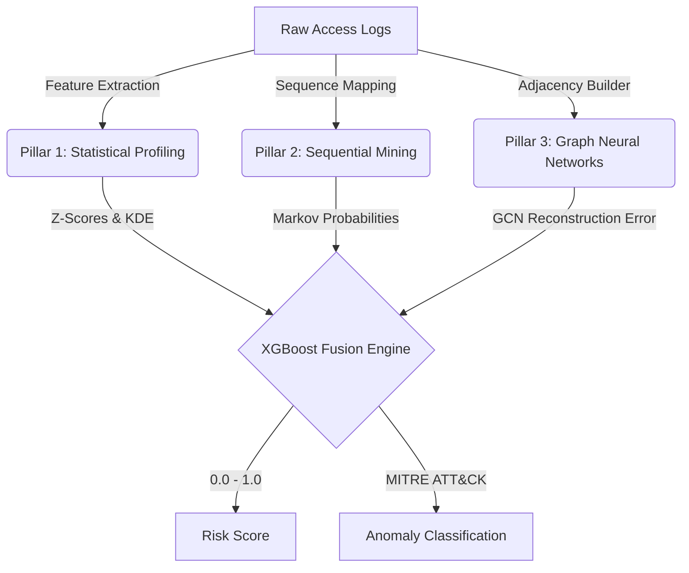

<div align="center">
  
  <h1>Vigil — AI-Powered Behavioral Anomaly Detection</h1>
  <p><em>Defeating Novel, Zero-Day, and Low-and-Slow Intrusions through Tri-Pillar Machine Learning</em></p>
  
  [](#)
  [](#)
  [](#)
  [](#)
</div>

<br />

> **Vigil** is a next-generation SOC threat-hunting engine. Instead of relying on rigid, signature-based rules, Vigil learns the normal behavioral rhythms, connection graphs, and sequential patterns of users, service accounts, and IoT devices. It detects deviations from the norm in near real-time, mapping threats to the MITRE ATT&CK framework.

---

## 🌟 The Tri-Pillar Architecture

Vigil evaluates every session through three independent, specialized machine learning pillars before fusing them into a final risk verdict.



### 1️⃣ Pillar A: Statistical Profiling
* **Method:** Dynamic Baseline Matrix (Z-Score & Kernel Density Estimation)
* **Target:** Credential Stuffing, Impossible Travel, Device Spoofing
* **How it works:** Tracks geospatial locations, operating hours, and device novelties. It calculates probability density for numerical features and tracks categorical novelty (e.g., seeing a MAC address for the very first time).

### 2️⃣ Pillar B: Sequential Mining
* **Method:** Markov Chains / Sequence Modeling
* **Target:** Low-and-Slow attacks, Insider Drift
* **How it works:** Evaluates the exact sequence of API calls or network requests. Attackers exploring a system (reconnaissance) leave sequential footprints that deviate from standard automated scripts or normal user workflows.

### 3️⃣ Pillar C: Graph Convolutional Networks (GCN)
* **Method:** Graph Convolutional Autoencoder (native PyTorch)
* **Target:** Lateral Movement, Privilege Escalation
* **How it works:** Models the entire network as a graph (Entities = Nodes, Access = Edges). The GCN performs unsupervised link prediction. High reconstruction error indicates that the topology of that connection is highly abnormal.

### 🧠 The Gradient Boosting Fusion Engine
Instead of a simple weighted average, Vigil feeds the outputs of the three pillars into an **Extreme Gradient Boosting (XGBoost)** classifier. The Fusion Engine learns complex, non-linear relationships (e.g., a slight geographic anomaly combined with a high Graph reconstruction error strongly indicates compromised credentials used for Lateral Movement).

---

## ⚡ Features & Capabilities

- **Real-Time SOC Dashboard:** Beautiful dark-mode React application tailored for Security Operations Centers.
- **Explainable AI (XAI):** Analysts are given an explicit breakdown of *why* an alert fired (e.g., "Flagged due to Geo-Velocity + New Device Fingerprint") alongside global feature importances.
- **Cold-Start Resilience:** New users without a baseline are evaluated against **Cohort-Level Baselines** (comparing a new HR employee against the aggregate behavior of the HR department) to prevent false positives.
- **O(1) Profile Lookups:** Statistical baselines are pre-computed allowing for instantaneous evaluations.
- **Automated PDF Reporting:** One-click generation of beautifully formatted, client-side rendered Threat Reports.
- **Interactive Topology Graphs:** Force-directed node graphs visualizing entity-to-resource interactions and suspect propagation.

---

## 🛠️ Tech Stack

### Backend (AI & API)
* **Python 3.10+**
* **FastAPI:** High-performance async API server.
* **PyTorch:** Native sparse-matrix GCN autoencoder.
* **XGBoost & Scikit-Learn:** Fusion engine and statistical modeling.
* **Pandas / Parquet:** Columnar data lake architecture for rapid querying.

### Frontend (Command Center)
* **React 18 & Vite:** Lightning-fast HMR and optimized builds.
* **Recharts:** High-performance SVGs for drift monitoring and feature importances.
* **react-force-graph-2d:** Canvas-based interactive topology graphs.
* **jsPDF:** Client-side dynamic report generation.

---

## 🚀 Getting Started

### 1. Generate Synthetic Data & Train Models
Vigil ships with a powerful data generator that simulates enterprise traffic and injects exact attack profiles (Brute Force, Lateral Movement, etc.) into the data lake.
```bash
# Generate the data and run the pipelines
python run_pipeline.py
```
*(This script will generate baselines, train the Sequence model, train the PyTorch GCN autoencoder, and finally train the XGBoost Fusion engine).*

### 2. Start the API Server
```bash
uvicorn api.main:app --reload --port 8000
```
*(The backend will run at `http://localhost:8000`)*

### 3. Start the SOC Command Center
```bash
cd frontend
npm install
npm run dev
```
*(The React frontend will be available at `http://localhost:5173`)*

---

## 📊 Evaluation & Metrics

Vigil is evaluated on severe class imbalances (true intrusions represent < 1% of the logs). 
* **PR-AUC (Precision-Recall Area Under Curve):** Monitored dynamically on the Metrics Dashboard.
* **Population Stability Index (PSI):** Actively tracks cohort drift over 14-day rolling windows to ensure the models aren't degrading due to shifting legitimate user behavior.

---

<div align="center">
  <i>Engineered for the modern threat landscape.</i>
</div>
